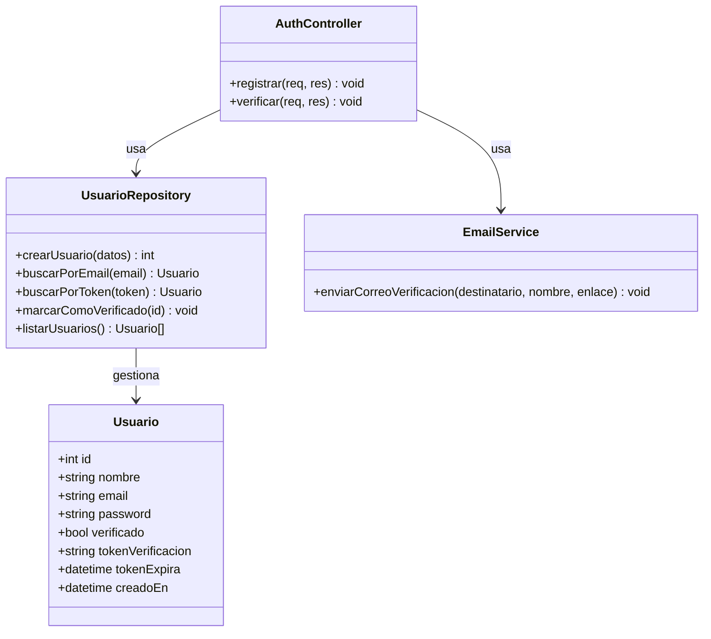

\# Proyecto: Registro de Usuarios con Verificación por Correo


Stack: \*\*Node.js + Express + SQLite (better-sqlite3)\*\*


\## Estructura del proyecto


```

proyecto-registro/

├── src/

│   ├── db/

│   │   ├── database.js        -> Conexión y creación de la tabla en SQLite

│   │   └── usuarioModel.js    -> Funciones para crear/buscar/verificar usuarios

│   ├── routes/

│   │   └── authRoutes.js      -> Endpoints /api/registro y /api/verificar/:token

│   ├── services/

│   │   └── emailService.js    -> Envío del correo de verificación (nodemailer)

│   └── server.js              -> Arranca el servidor Express

├── public/

│   └── index.html             -> Formulario de registro

├── .env.example                -> Plantilla de configuración

├── .gitignore

├── package.json

└── README.md

```


\## Diagrama de clases





