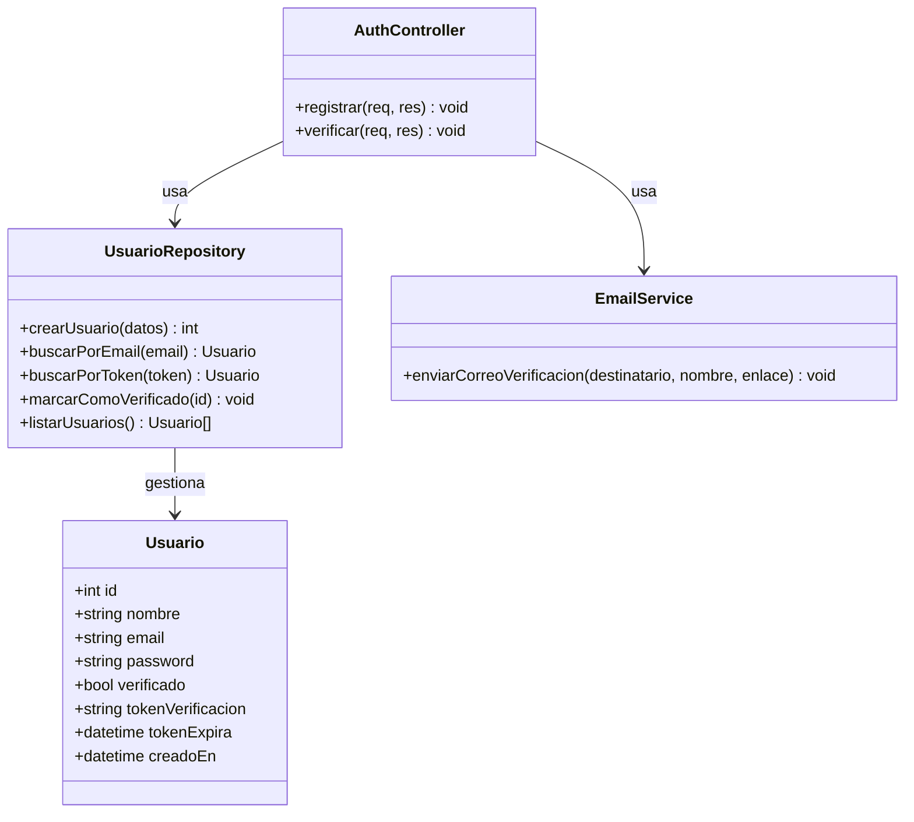

# Proyecto: Registro de Usuarios con Verificación por Correo

Stack: **Node.js + Express + SQLite (better-sqlite3)**

## Estructura del proyecto

```
proyecto-registro/
├── src/
│   ├── db/
│   │   ├── database.js        -> Conexión y creación de la tabla en SQLite
│   │   └── usuarioModel.js    -> Funciones para crear/buscar/verificar usuarios
│   ├── routes/
│   │   └── authRoutes.js      -> Endpoints /api/registro y /api/verificar/:token
│   ├── services/
│   │   └── emailService.js    -> Envío del correo de verificación (nodemailer)
│   └── server.js              -> Arranca el servidor Express
├── public/
│   └── index.html             -> Formulario de registro
├── .env.example                -> Plantilla de configuración
├── .gitignore
├── package.json
└── README.md
```

## Diagrama de clases



## Instalación y ejecución

1. Instalar dependencias:
```
   npm install
```

2. Copiar el archivo de configuración:
```
   cp .env.example .env
```
   (En Windows: `copy .env.example .env`)

3. Configurar el envío de correos en `.env`. Ejemplo con Gmail:
   - Activar la verificación en 2 pasos en la cuenta de Gmail que se use para enviar correos: https://myaccount.google.com/security
   - Generar una contraseña de aplicación en: https://myaccount.google.com/apppasswords
   - Completar el `.env`:
```
     SMTP_HOST=smtp.gmail.com
     SMTP_PORT=587
     SMTP_USER=tucorreo@gmail.com
     SMTP_PASS=la_contraseña_de_aplicacion
     SMTP_FROM=tucorreo@gmail.com
```

   > **Nota:** si no se configura el `.env`, el proyecto sigue funcionando igual: el enlace de verificación se imprime en la consola del servidor en lugar de enviarse por correo real, de modo que se puede probar el flujo completo sin necesidad de credenciales SMTP.

4. Levantar el servidor:
```
   npm start
```

5. Abrir en el navegador: `http://localhost:3000`
   - Llenar el formulario y registrar un usuario.
   - Revisar el correo (o la consola del servidor si no se configuró SMTP) para obtener el enlace de verificación.
   - Hacer clic en el enlace para verificar la cuenta.

6. Confirmar que quedó verificado entrando a: `http://localhost:3000/api/usuarios`

> **Nota sobre el correo:** los mensajes de verificación pueden llegar a la carpeta de **Spam / Correo no deseado**, especialmente si la cuenta de Gmail configurada es nueva o recién empezó a enviar correos automáticos. Revisar ahí si no aparece en la bandeja de entrada.

## Variables de entorno

| Variable      | Descripción                                                |
|---------------|-------------------------------------------------------------|
| `PORT`        | Puerto donde corre el servidor (por defecto 3000)           |
| `BASE_URL`    | URL base usada para construir el enlace de verificación     |
| `SMTP_HOST`   | Servidor SMTP (ej. `smtp.gmail.com`)                         |
| `SMTP_PORT`   | Puerto SMTP (587 para TLS, 465 para SSL)                     |
| `SMTP_USER`   | Correo remitente                                             |
| `SMTP_PASS`   | Contraseña de aplicación del correo remitente                |
| `SMTP_FROM`   | Correo que aparece como remitente en el mensaje enviado      |

El archivo `.env` **no se sube al repositorio** (está en `.gitignore`) por seguridad. Cada persona que descargue el proyecto debe crear su propio `.env` a partir de `.env.example`.

## Endpoints disponibles

| Método | Ruta                        | Descripción                                   |
|--------|-----------------------------|------------------------------------------------|
| POST   | `/api/registro`             | Registra un nuevo usuario y envía el correo de verificación |
| GET    | `/api/verificar/:token`     | Verifica la cuenta a partir del token recibido por correo   |
| GET    | `/api/usuarios`             | Lista los usuarios registrados (para pruebas)               |


